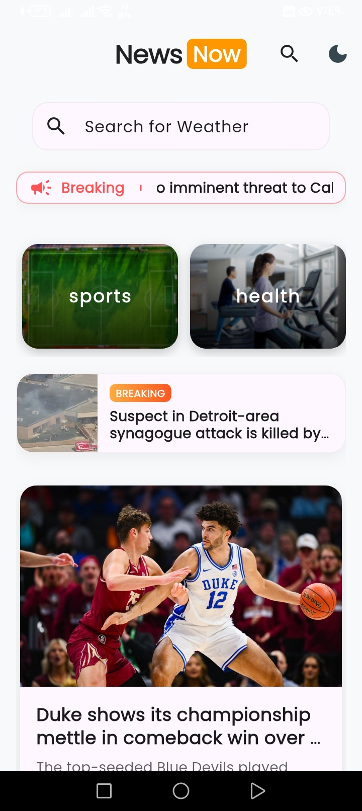
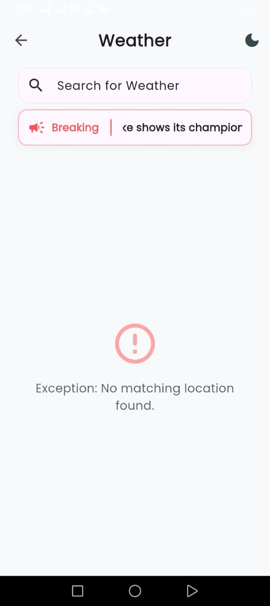
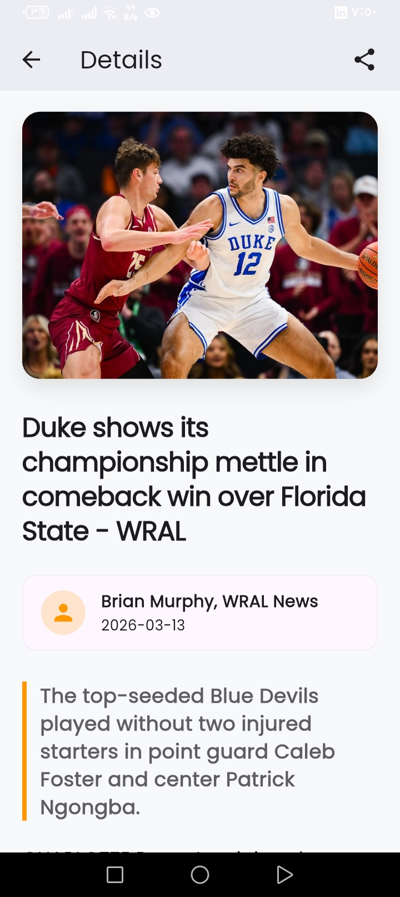
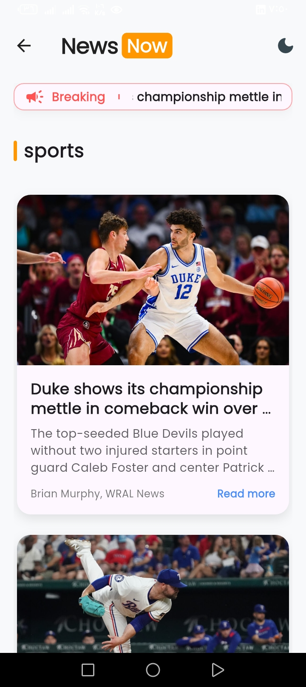
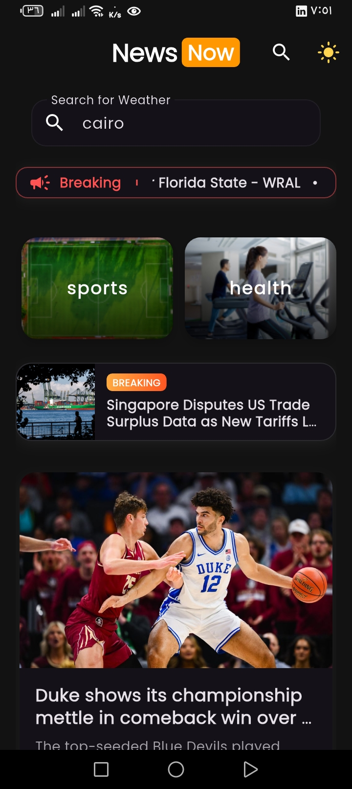
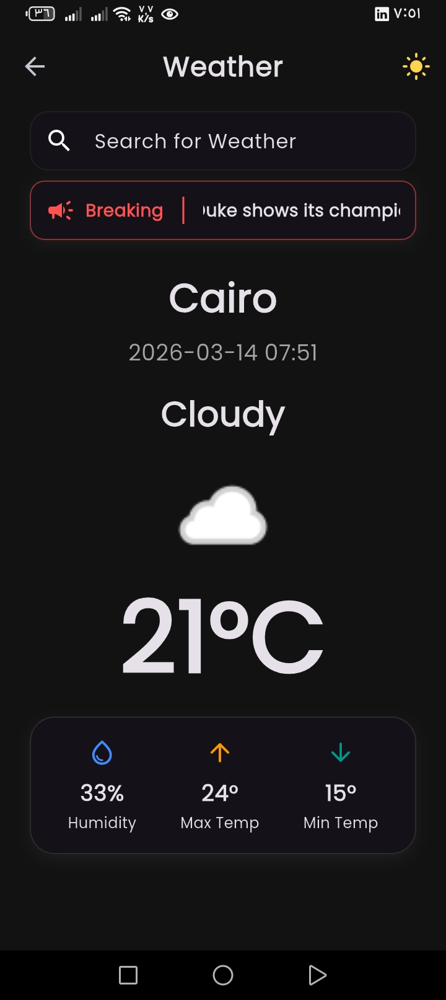
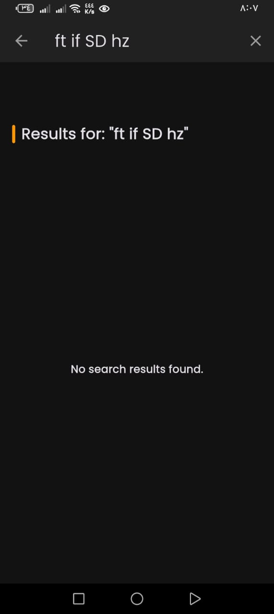
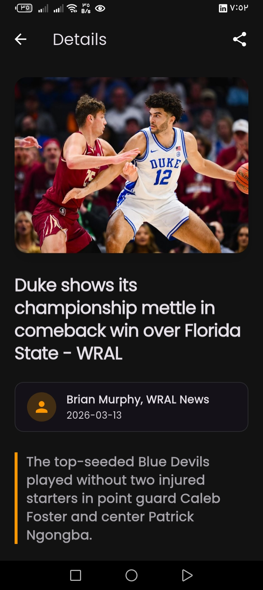

# 🗞️ News Now

[](https://flutter.dev/)
[](https://dart.dev/)
[](https://pub.dev/packages/flutter_bloc)

A professional, feature-rich news application built with Flutter that provides real-time news updates, weather information, and a seamless user experience with offline support.

---

## 📽️ Preview


---

## ✨ Key Features

-   **🏠 Dynamic Home Screen**: Featured news slider with the latest headlines and weather integration.
-   **🔍 Smart Search**: Search for news articles or weather conditions by city name.
-   **📂 Category Browsing**: News organized by categories (Business, Entertainment, General, Health, Science, Sports, Technology).
-   **🌙 Dark & Light Mode**: Full support for system-wide themes with a premium design.
-   **💾 Offline Access**: Powered by **Hive**, news and images are cached for reading even without an internet connection.
-   **🌦️ Weather Integration**: Real-time weather data displayed on the home page and searchable via city.
-   **📰 Article Details**: Clean, modern article view with web previews and sharing capabilities.
-   **🚀 Performance**: Smooth animations and shimmer effects for a premium loading experience.

---

## 🛠️ Tech Stack

-   **Frontend**: Flutter (Dart)
-   **State Management**: `flutter_bloc` (Cubit/BLoC pattern)
-   **Networking**: `dio` for robust API requests.
-   **Local Storage**: `hive` for high-performance offline caching.
-   **UI Enhancements**:
    -   `shimmer` for skeleton loaders.
    -   `marquee` for scrolling headlines.
    -   `cached_network_image` for image optimization.
-   **Utilities**: `url_launcher`, `share_plus`, `equatable`.

---

## 📸 Screenshots Gallery

| Home Screen | News Search | Weather Search |
| :---: | :---: | :---: |
|  |  |  |

| Article Details | Category View | Home (Dark) |
| :---: | :---: | :---: |
|  |  |  |

| Weather (Dark) | Search (Dark) | Article (Dark) |
| :---: | :---: | :---: |
|  |  |  |

---

## 🚀 How to Run

1.  **Clone the repository**:
    ```bash
    git clone https://github.com/eng-khaled-sameh/news_now.git
    ```
2.  **Navigate to the project directory**:
    ```bash
    cd news_now
    ```
3.  **Install dependencies**:
    ```bash
    flutter pub get
    ```
4.  **Run the application**:
    ```bash
    flutter run
    ```

---

## 👨‍💻 About the Developer

### **Khaled Sameh**
*Telecommunication and Electronics Engineering student (4th year) at Obour Higher Institute for Engineering and Technology.*

I am an aspiring engineer with a strong interest in **mobile networks, wireless communication systems, and telecommunications technologies**, in addition to gaining professional experience in **mobile app development using Flutter**.

#### 🎓 Current Focus & Training:
* Currently enhancing my technical skills through **NTI scholarships**, including **Mobile Communication** training and **Flutter development** training.
* I am actively seeking internships and practical training opportunities to further develop my skills and gain real-world experience in the telecommunications and software engineering fields.

#### 🔗 Connect with me:
-   **GitHub**: [@eng-khaled-sameh](https://github.com/eng-khaled-sameh)
-   **LinkedIn**: [Khaled Sameh](https://www.linkedin.com/in/khaled-sameh-1aab53373)

---

## 📝 License

This project is licensed under the MIT License - see the [LICENSE](LICENSE) file for details.